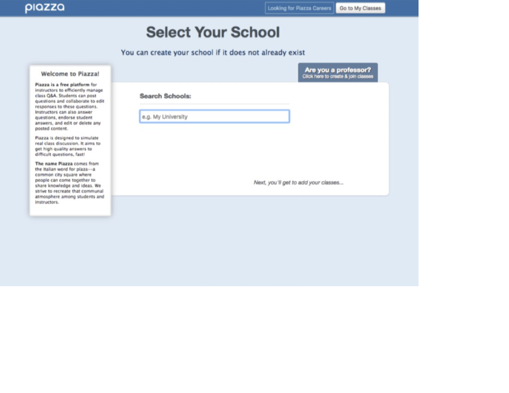
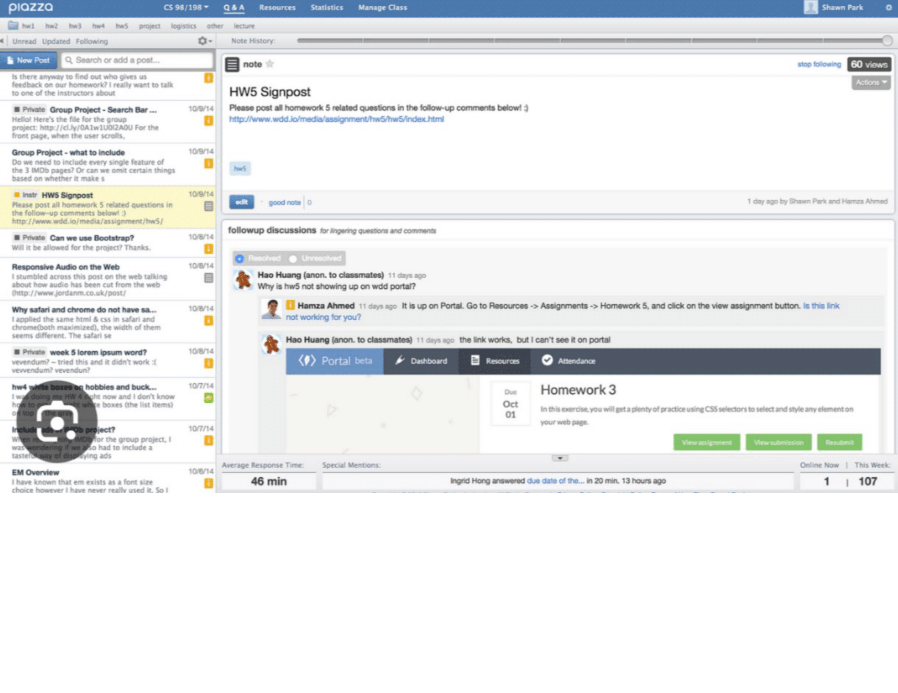
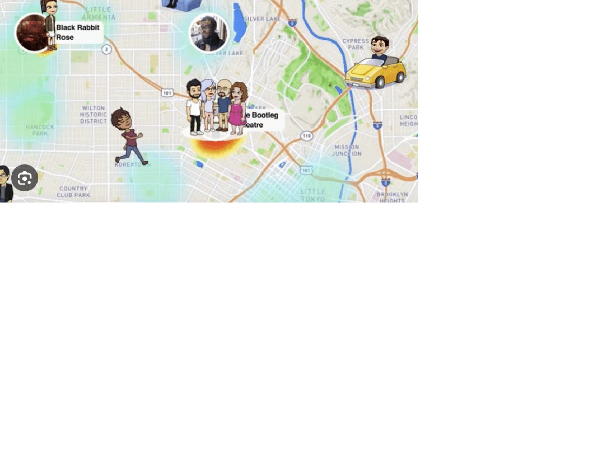
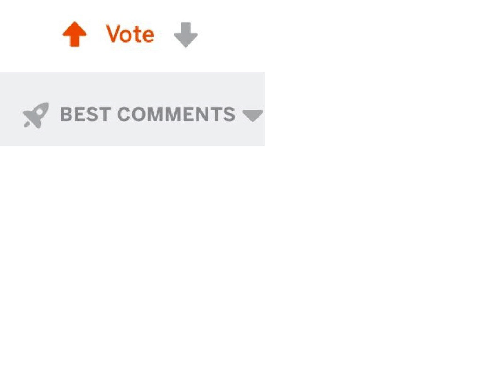
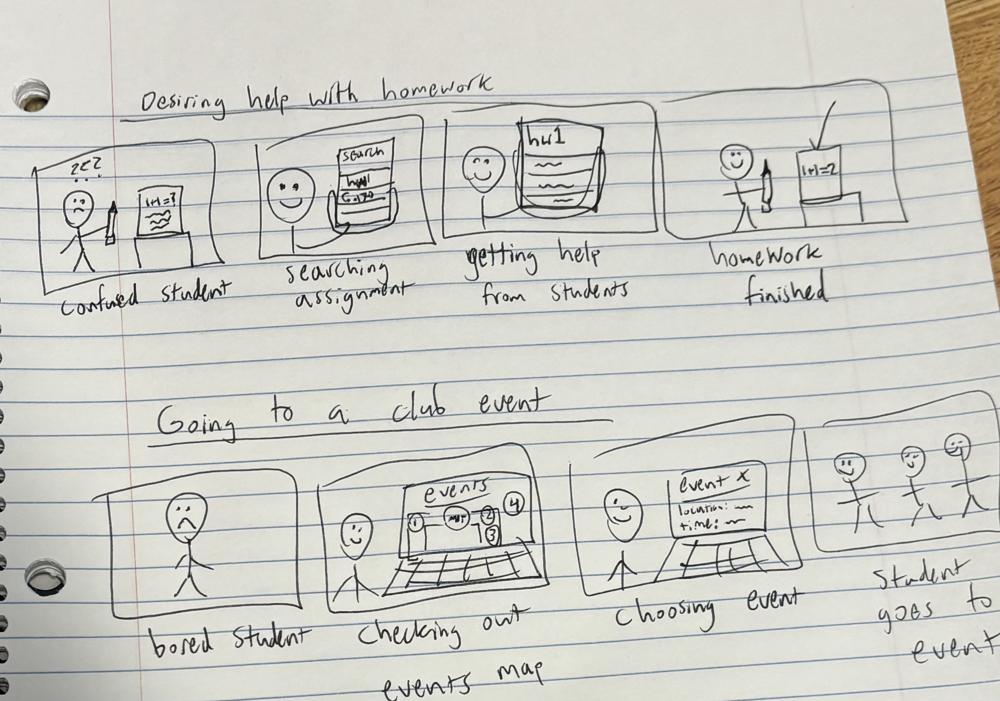

**App name:** UniChat  
--------------------- 
**Audience:** College students  
----------------------------- 
**Value:** This app will focus on allowing students from the same colleges to interact with each other by implementing user authentication based on the school they go to. It will have features that allow students from the same school to connect with each other and find information easily by having searchable threads related to classes, living communities, events, etc.
  

**Comparables**

The authentication feature could be based off of Piazza's college authentication feature. This will ensure only students who actually attend those universities can join.
{:width='500'}
 
ESPN's score feature could be used as inspiration to display each school's sports team's live scores.
{:width='1000'}
 
Since threads would be the main feature of the app, the organizational layout could be similar to Piazza's thread with a search function and tags.
{:width='500'}
 
To display events and where people are on campus, Snapchat's "Snapmap" feature could be used as inspiration.
{:width='700'}
 
Reddit's upvoting system could be implemented for threads and comments posted by people
{:width='500'}

  
<u><b>Feature Ideas:</b></u>

<ol>
  <li>Monochromaticity - Toggleable feature that allows users to make the entire interface monochrome to encourage themselves to spend less time on the app and focus on their schoolwork.</li>
  <li>Emergency notifications - Allow users to send a notification to every user to announce important information such as an emergency. Users may be banned from the app for misuse of this feature.</li>
  <li>Carpool feature - students who have cars can announce that they will be going from place x to place y at a certain time, allowing people to reserve their spots in the car. The driver would receive points (point system mentioned below) for each trip.</li>
  <li>Scores tab - users can see official scores of their school’s sports teams and live updates.</li>
  <li>Scheduled DM’s - users can write messages or create threads and schedule them to be sent/posted at a later time.</li>
  <li>Free food map - allow users to label locations where there is free food and display it on a live map. Users who take food from the free food location may mark it as “finished” once the food runs out.</li>
  <li>Temporary live chats - users in the same classes or organizations can join a live video call that is constantly running for each class/organization and people may hop in and out of the call at any time.</li>
  <li>Resale interface - students who wish to sell some of their belongings can advertise them on this page. It would include a comment section for customers to ask questions or offer bids.</li>
  <li>Argument threads - Use natural language processing to detect when a thread is very political or argumentative and forcefully label the thread as “heated” so that users know what they are getting into.</li>
  <li>Time spent on app - Users can see how much time they have spent on the app each week, day, and current session. They could also see graphs of their usage over time.</li>
  <li>Interactivity statistics - This page would show users how many threads they have participated in, how many upvotes they have gotten, and how many campus events they have been to, among other statistics.</li>
  <li>Point system - In order to incentivize users to answer each other’s questions in threads and to interact more with people they don’t know, there can be a point system allowing users to be rewarded in varying amounts based on different types of interactions. For instance, users could gain or lose points every time one of their replies or threads gets upvoted/downvoted.</li>
  <li>Blurring and worsened app quality - Toggleable feature that allows users to blur the entire interface, decreasing picture/video quality and making it harder to read text. This will allow users to keep themselves accountable and spend less time on the app when they need to focus on schoolwork.</li>
  <li>Population density map - Map showing the number of people on different areas of campus at any given time.</li>
  <li>Event map - Map showing number of events at each building this week, allowing users to see events happening that day, week, and month.</li>
  <li>One-sided anonymous DM’s - the person who initiates the DM has the option to remain anonymous.</li>
  <li>Anonymous threads - users have the ability to start a public thread (kind of like a Tweet) while remaining anonymous.</li>
  <li>Videos and images in threads - Users also have the ability to include videos and images in addition to text when creating a thread.</li>
  <li>Polls - users can include a poll in a thread. One potential use-case for the poll feature would be to organize an event by asking at what times people are available.</li>
  <li>Tags - allows users to add tags to each thread so that users can search for specific classes, organizations, living communities, etc that have those specific tags.</li>
</ol>

  
<u><b>VSD Analysis:</b></u>

<u>Observation:</u> If the app were to be adopted by hundreds or thousands of students in the same school, conflicts and arguments would arise in threads.  
<u>Design response:</u> Having an upvote and downvote feature would discourage unethical comments and encourage people to uplift each other and answer each other’s questions.
  
<u>Observation:</u> If students from the same classes were to be in threads together without any moderators, cheating scandals could arise.  
<u>Design response:</u> In class-related threads, anonymity would be banned and students would have the ability to report cheating in order to discourage this kind of behavior.
  
<u>Observation:</u> If events are publicized effectively on the app, there could be problems with crowd control and the number of people that end up going to events.  
<u>Design response:</u> To control event size, there could be a feature forcing users to say whether or not they are going and not make the event public until the creator of the event has officially reserved an appropriately-sized room for the event.
  
<u>Observation:</u> with the map feature displaying the number of people at each location, privacy would be violated.  
<u>Design response:</u> To address this, users can choose whether or not to show their location. However, they would be encouraged to turn on this feature to show more accurate results of the number of people at different events and places on campus.
  
<u>Observation:</u> Having a point system might incentivize some students to exploit the system by spamming threads and comments in order to gain points.  
<u>Design response:</u> To discourage this, the number of points earned will be mainly based on response from other users, such as upvotes and responses to the threads.
  
<u>Observation:</u> The emergency notifications feature could be abused by users even with threats of banning them from the app.  
<u>Design response:</u> Users could have the option to opt in or out of the emergency notifications feature and have the emergency notification go out to everyone only until at least two other people confirm it as accurate.
  

  
<u><b>Storyboarding and Sketching:</b></u>
{:width='500'}
